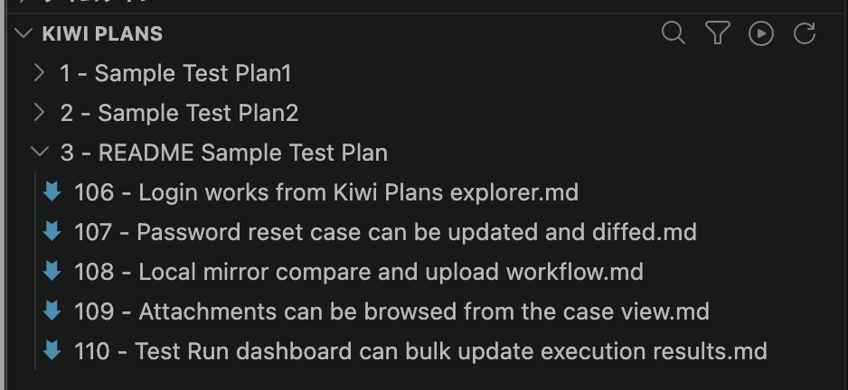
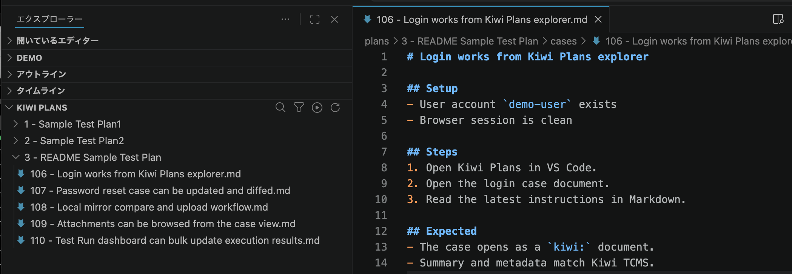
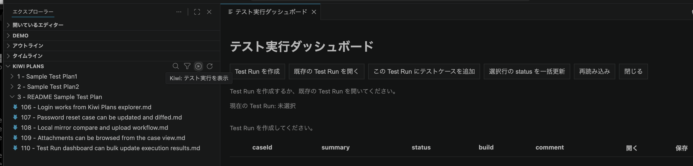
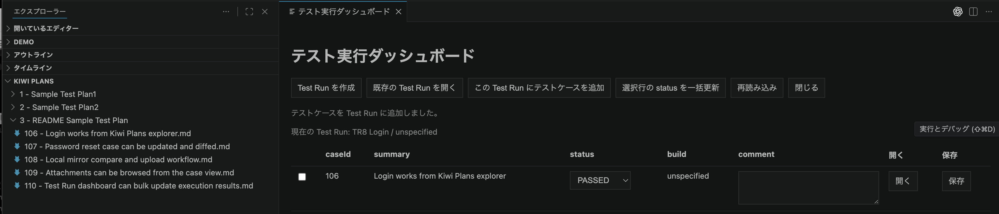
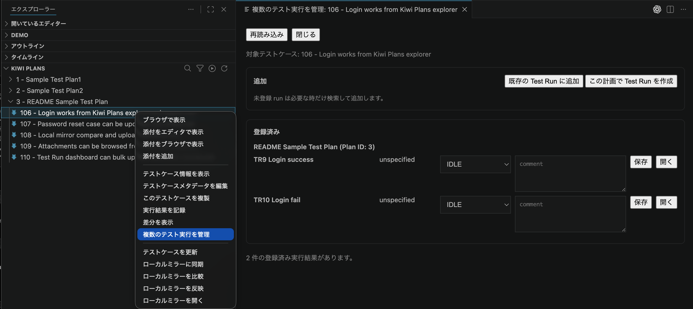
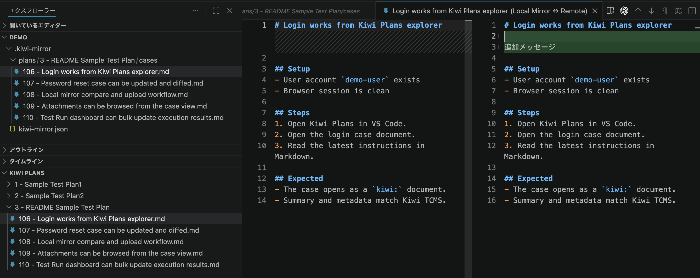

# vscode-kiwifs

## Overview

`Kiwi FS` は、Kiwi TCMS のテスト計画やテストケースを VS Code で見たり、更新したりできる拡張機能です。  
`Kiwi Plans` からテスト計画を開き、テストケースの本文確認、編集、添付確認、実行結果の更新を進められます。

必要に応じて、テストケース本文をローカルファイルとして取り出し、Codex などの LLM や手元のツールで参照・比較・反映しやすくする `local mirror` も使えます。

<!-- screenshot: kiwi-plans-overview -->

  

## この拡張でできること

- `Kiwi Plans` でテスト計画とテストケースを一覧する
- テストケースを VS Code で開いて、そのまま更新する
- テストケースの情報や添付を確認する
- 既存テストケースを計画に追加したり、計画から外したりする
- 実行結果を記録する
- 必要なときだけ local mirror を使ってローカルで比較・編集する

## Installation

Marketplace からインストールする場合:

1. Extensions ビューで `Kiwi FS` または `vscode-kiwifs` を検索する
2. `yyamamot.vscode-kiwifs` を選ぶ
3. `Install` を押して有効化する
4. `Kiwi: Configure Base URL`, `Kiwi: Configure Username`, `Kiwi: Configure Password` を設定する

検証用には VSIX からのインストールもできます。

## Quick Start

### 1. 接続先を設定する

Command Palette から次を実行します。

- `Kiwi: Configure Base URL`
- `Kiwi: Configure Username`
- `Kiwi: Configure Password`

| 項目 | 内容 |
| --- | --- |
| Base URL | `https://kiwi.example.com/` のような Kiwi TCMS URL |
| Username | Kiwi TCMS のログインユーザー名 |
| Password | Kiwi TCMS のログインパスワード |
| 保存先 | Base URL は settings、username/password は Secret Storage |

### 2. `Kiwi Plans` を開く

`Kiwi: Open Root` を実行すると、Explorer に `Kiwi Plans` が表示されます。  
ここからテスト計画を開いて、配下のテストケースを確認できます。

<!-- screenshot: kiwi-plan-context -->

  

### 3. テストケースを開いて更新する

- テスト計画を展開してテストケースを選ぶ
- VS Code 上で本文を開く
- 必要な内容を修正して保存する
- 必要に応じて `差分を表示` や `テストケースを更新` を使う

### 4. 添付や追加情報を確認する

テストケースの右クリックメニューから次の操作ができます。

- `テストケース情報を表示`
- `添付一覧を表示`
- `添付をエディタで表示`
- `添付をブラウザで表示`
- `ブラウザで表示`

### 5.1 テスト実行を作成および実行結果を更新

- KIWI PLANS 右クリックの `テスト実行を表示` からテスト実行作成および結果を更新できます。

<!-- screenshot: kiwi-test-run-dashboard1 -->

  

<!-- screenshot: kiwi-test-run-dashboard2 -->

  

### 5.2 テスト実行を作成および実行結果を更新(複数テストケース対応版)

- テストケースの右クリックの `複数のテスト実行を管理` からテスト実行作成および結果を更新できます。

<!-- screenshot: kiwi-test-run-dashboard -->

  

### 6. 必要なら local mirror を使う

local mirror は、テストケース本文をローカルファイルとして扱いたいときに使います。

1. `ローカルミラーに同期` または `配下をローカルミラーに同期`
2. `ローカルミラーを比較`
3. `ローカルミラーを反映`

local mirror は `.kiwi-mirror/...` 配下に作られ、ローカル編集や外部ツールとの連携に使えます。

<!-- screenshot: kiwi-local-mirror / Replace assets/readme3.png with a local mirror screenshot -->

## Features

| 機能 | できること | 備考 |
| --- | --- | --- |
| テスト計画の一覧 | `Kiwi Plans` で計画とテストケースを確認 | Explorer から使える |
| テストケースの更新 | テストケース本文を VS Code で開いて保存 | 通常の編集感覚で扱える |
| テストケース情報の確認 | summary、status、priority、tags などを表示 | 本文とは別に確認できる |
| テストケース情報の編集 | `summary / status / priority / tags` を更新 | 必要な項目だけ変更できる |
| テストケースの作成・複製 | 新しいケース作成、既存ケース複製 | 計画単位で追加できる |
| 計画への追加・解除 | 既存ケースを計画に追加、または外す | QuickPick で選択 |
| テストケースの検索・絞り込み | ID、summary、status、priority、tags で探せる | 目的のケースを探しやすい |
| local mirror | テストケース本文をローカルへ取り出す | 比較や反映もできる |
| 添付ファイル | 一覧表示、追加、ブラウザ/エディタ表示 | ケース確認を補助 |
| 実行結果の更新 | case 単位の実行結果記録 | 日々のテスト更新向け |
| Test Run dashboard | run 作成、case 追加、まとめ更新 | 実行管理を VS Code で行える |
| ブラウザ連携 | plan / case の Kiwi TCMS 画面を開く | Web UI で詳しく見たいときに使う |

## Commands / Main Workflows

### 接続と基本操作

| 目的 | コマンド |
| --- | --- |
| Kiwi Plans を開く | `Kiwi: Open Root` |
| Base URL を設定 | `Kiwi: Configure Base URL` |
| Username を設定 | `Kiwi: Configure Username` |
| Password を設定 | `Kiwi: Configure Password` |
| 設定を消す | `Kiwi: Clear Base URL`, `Kiwi: Clear Username`, `Kiwi: Clear Password`, `Kiwi: Clear Configuration` |

### テストケースを探す・更新する

| 目的 | コマンド |
| --- | --- |
| テストケース検索 | `Kiwi: テストケースを検索` |
| テストケースフィルタ | `Kiwi: テストケースをフィルタ` |
| テストケース情報表示 | `テストケース情報を表示` |
| テストケース本文更新 | `テストケースを更新` |
| 差分表示 | `差分を表示` |
| メタデータ編集 | `テストケースメタデータを編集` |
| 複製 | `このテストケースを複製` |

### テスト計画の操作

| 目的 | コマンド |
| --- | --- |
| テスト計画表示 | `テスト計画を表示` |
| 新規テストケース作成 | `新規テストケースを作成` |
| 既存ケース追加 | `既存テストケースをこの計画に追加` |
| ケース解除 | `テストケースをこの計画から外す` |

### Local mirror operations

| 目的 | コマンド |
| --- | --- |
| case mirror 同期 | `ローカルミラーに同期` |
| plan 配下 mirror 同期 | `配下をローカルミラーに同期` |
| mirror 比較 | `ローカルミラーを比較` |
| mirror 反映 | `ローカルミラーを反映` |
| mirror を開く | `ローカルミラーを開く` |
| plan の mirror 状態表示 | `ローカルミラー状態を表示` |

## Limitations

| 事項 | 補足 |
| --- | --- |
| ローカルドライブのようには使わない | VS Code の拡張機能として使う前提です |
| delete / rename は未対応 | 現在は扱いません |
| 編集できる metadata は一部のみ | `summary / status / priority / tags` が対象です |
| local mirror は必要な人向けの追加機能 | 通常の確認・更新だけなら使わなくても問題ありません |
| runtime log は通常利用では使いません | F5 デバッグ時だけ有効です |

## Requirements / Compatibility

| 項目 | 内容 |
| --- | --- |
| VS Code | Desktop 版 `1.105+` |
| Kiwi TCMS | XML-RPC に接続できる環境 |
| 動作確認 | Kiwi TCMS `15.3` で確認 |
| 認証 | Base URL + username + password |
| ローカル作業 | local mirror を使う場合は file workspace 推奨 |

## License

- License: [MIT](./LICENSE)
